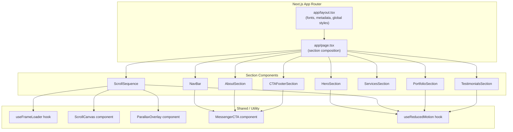

# Design Document: Anna Nails Landing Page

## Overview

This design describes a luxury "scrollytelling" single-page landing page for **Anna Nails**, a premium nail technician brand in Wolverhampton, UK. The page is built with Next.js 14 (App Router), Tailwind CSS, Framer Motion, and HTML5 Canvas. The centrepiece is a scroll-synced image sequence that scrubs through 240 pre-loaded frames on a pinned canvas, narrating a nail transformation story. All booking funnels through a Facebook Messenger deep-link — there is no booking form.

### Key Design Decisions

| Decision | Choice | Rationale |
|---|---|---|
| Rendering framework | Next.js 14 App Router | SSR/SSG support, `next/font` for zero-CLS font loading, `next/image` for optimised images |
| Styling | Tailwind CSS | Utility-first approach matches the single-page scope; easy dark-theme tokens via `tailwind.config` |
| Animation | Framer Motion | `useScroll`, `useTransform`, `useMotionValueEvent` provide declarative scroll-linked animation; `AnimatePresence` + `layout` for portfolio filter transitions |
| Scroll sequence | HTML5 Canvas + `requestAnimationFrame` | Canvas `drawImage` is the most performant way to scrub pre-loaded frames; avoids video codec overhead |
| Font loading | `next/font/google` | Self-hosts fonts at build time, eliminates external requests, prevents layout shift |
| Masonry layout | Tailwind CSS `columns-*` | Native CSS multi-column layout; no extra dependency needed |
| Messenger CTA | `https://m.me/[page-username]` deep-link | Direct conversion path; opens native Messenger app on mobile, web Messenger on desktop |

### Research Summary

- **Scroll-synced canvas**: The standard pattern (used by Apple and similar editorial sites) preloads all frames into an `Image[]` array via `Promise.all`, then maps `scrollYProgress` (0–1) to a frame index (0–N) and draws with `ctx.drawImage()` inside a `requestAnimationFrame` loop. Framer Motion's `useScroll({ target, offset })` provides the scroll progress value. ([Source: dev.to](https://dev.to/pipscript/creating-a-png-sequence-animation-using-react-and-scss-k71), [Source: motion.dev](https://motion.dev/docs/react-use-scroll))
- **Framer Motion scroll hooks**: `useScroll` returns `scrollYProgress` (0–1 MotionValue). `useTransform` maps this to arbitrary output ranges. For the parallax overlays, `useTransform` can map scroll ranges to opacity values (0→1→0) for fade-in/fade-out text. ([Source: motion.dev](https://motion.dev/docs/react-use-scroll))
- **Tailwind masonry**: CSS `columns-2 md:columns-3 lg:columns-4` with `break-inside-avoid` on children produces a column-based masonry layout without JavaScript. ([Source: dev.to](https://dev.to/hungle00/build-a-masonry-layout-pinterest-layout-3glp))
- **CSS shimmer/bokeh**: A slow-motion shimmer can be achieved with CSS `radial-gradient` layers animated via `@keyframes` — multiple soft circles at varying sizes and positions, slowly drifting, create a bokeh-like glitter effect without video or Canvas. ([Source: winterwind.com](https://www.winterwind.com/tutorials/css/16))
- **`next/font`**: Importing from `next/font/google` with `subsets: ['latin']` and `display: 'swap'` self-hosts the font files and injects the CSS variable automatically. Multiple fonts can be loaded and applied via CSS variables on `<body>`. ([Source: nextjs.org](https://nextjs.org/docs/pages/getting-started/fonts))

---

## Architecture

The application is a single Next.js 14 App Router page (`app/page.tsx`) composed of discrete section components. All components are **Client Components** (`"use client"`) because they rely on browser APIs (Canvas, scroll events, Framer Motion hooks, `window.matchMedia`).

### High-Level Architecture



### Component Rendering Strategy

| Component | Rendering | Why |
|---|---|---|
| `app/layout.tsx` | Server Component | Static metadata, font injection, no browser APIs |
| `app/page.tsx` | Client Component | Orchestrates scroll-dependent children |
| All section components | Client Components | Framer Motion hooks, Canvas API, event listeners |

### File Structure

```
app/
├── layout.tsx              # Root layout: fonts, metadata, <html>/<body>
├── page.tsx                # Main page: composes all sections
├── globals.css             # Tailwind directives + custom CSS (shimmer keyframes)
components/
├── NavBar.tsx              # Sticky nav with hamburger menu
├── HeroSection.tsx         # Full-viewport hero with shimmer background
├── ScrollSequence.tsx      # Pinned scroll sequence orchestrator
├── ScrollCanvas.tsx        # Canvas element + frame drawing logic
├── ParallaxOverlay.tsx     # Fade-in/out text overlays
├── PortfolioSection.tsx    # Masonry grid with filter tabs
├── AboutSection.tsx        # Split layout about section
├── ServicesSection.tsx     # Service card grid
├── TestimonialsSection.tsx # Drag-to-scroll carousel
├── CTAFooterSection.tsx    # Final CTA + footer
├── MessengerCTA.tsx        # Reusable Messenger deep-link button
├── ProgressBar.tsx         # Frame loading progress indicator
hooks/
├── useFrameLoader.ts       # Frame preloading logic + progress state
├── useReducedMotion.ts     # prefers-reduced-motion media query hook
├── useScrollFrame.ts       # Maps scroll progress to frame index
lib/
├── constants.ts            # Shared constants (colours, frame count, overlay milestones)
├── portfolio-data.ts       # Portfolio image metadata + categories
├── services-data.ts        # Service card content
├── testimonials-data.ts    # Testimonial content
```

---

## Components and Interfaces

### 1. `app/layout.tsx` (Server Component)

Responsible for:
- Loading fonts via `next/font/google` (Cormorant Garamond, Playfair Display, Inter)
- Setting `<html lang="en">` and applying font CSS variables to `<body>`
- Injecting `<meta>` title and description for SEO
- Importing `globals.css`

```typescript
// Font setup
const cormorant = Cormorant_Garamond({
  subsets: ['latin'],
  weight: ['400', '600', '700'],
  variable: '--font-cormorant',
  display: 'swap',
});
const playfair = Playfair_Display({
  subsets: ['latin'],
  weight: ['400', '700'],
  variable: '--font-playfair',
  display: 'swap',
});
const inter = Inter({
  subsets: ['latin'],
  variable: '--font-inter',
  display: 'swap',
});
```

### 2. `NavBar`

**Props:** None (self-contained)

**Behaviour:**
- Fixed position (`sticky top-0 z-50`) with semi-transparent dark background + backdrop blur
- Desktop: logo left, anchor links centre, "Book Now" CTA right
- Mobile (< 768px): logo left, hamburger icon right; tapping hamburger opens a full-screen overlay with nav links
- Anchor links: `#hero`, `#portfolio`, `#about`, `#services`, `#testimonials`, `#contact`
- All interactive elements have `aria-label` attributes

**State:**
- `isMenuOpen: boolean` — controls mobile menu visibility

### 3. `HeroSection`

**Props:** None

**Behaviour:**
- Full viewport height (`h-screen`)
- Headline "Art You Wear." in serif heading font, `text-white/90`
- Sub-headline "Luxury nail artistry. Wolverhampton." in Inter, `text-white/60`
- Background: CSS-only shimmer/bokeh effect using multiple animated `radial-gradient` layers
- Animated downward chevron with "Scroll to Explore" label, using Framer Motion `animate` with `y` oscillation
- When `prefers-reduced-motion: reduce` is active, shimmer animation pauses and chevron is static

### 4. `ScrollSequence`

**Props:** None

**Behaviour:**
- Wraps `ScrollCanvas`, `ParallaxOverlay`, and `ProgressBar`
- Uses a tall container (`h-[350vh]`) with a sticky inner wrapper (`sticky top-0 h-screen`)
- Uses Framer Motion `useScroll({ target: containerRef, offset: ["start start", "end end"] })` to get `scrollYProgress`
- Passes `scrollYProgress` to `ScrollCanvas` and `ParallaxOverlay`
- While frames are loading (from `useFrameLoader`), renders `ProgressBar` and disables scroll interaction via `overflow-hidden` on the container
- When `prefers-reduced-motion` is active, renders a static `<Image>` of the final frame instead

**State:**
- `frames: HTMLImageElement[]` — from `useFrameLoader`
- `loadingProgress: number` — 0–1, from `useFrameLoader`
- `isLoaded: boolean` — from `useFrameLoader`

### 5. `ScrollCanvas`

**Props:**
```typescript
interface ScrollCanvasProps {
  frames: HTMLImageElement[];
  scrollProgress: MotionValue<number>;
}
```

**Behaviour:**
- Renders a `<canvas>` element sized to fill the viewport (`w-full h-full`)
- Subscribes to `scrollProgress` via `useMotionValueEvent` or `useTransform`
- Maps progress (0–1) → frame index (0–239) using `Math.min(Math.floor(progress * TOTAL_FRAMES), TOTAL_FRAMES - 1)`
- Draws the current frame using `ctx.drawImage()` inside `requestAnimationFrame`
- Handles canvas resize on window resize to maintain aspect ratio (cover mode)

### 6. `ParallaxOverlay`

**Props:**
```typescript
interface ParallaxOverlayProps {
  scrollProgress: MotionValue<number>;
}
```

**Behaviour:**
- Positioned absolutely over the canvas
- Defines overlay milestones as frame ranges mapped to text:
  - Frames 1–10: "The Canvas."
  - Frames 11–25: "The Craft."
  - Frames 26–40: "The Art."
  - Frames 41–240: "Anna Nails. Wolverhampton."
- Converts frame ranges to scroll progress ranges (e.g. frames 1–10 → progress 0–0.042)
- Uses `useTransform` to map `scrollProgress` to opacity (0→1→0) for each text block
- Text rendered in heading serif font, `text-white/90`, centred

### 7. `PortfolioSection`

**Props:** None

**Behaviour:**
- Section heading "The Work." in serif font
- Filter tabs: "All", "Gel", "Acrylics", "Nail Art", "Press-Ons"
- Active tab highlighted with champagne gold underline
- Masonry grid using Tailwind `columns-2 md:columns-3 lg:columns-4` with `break-inside-avoid`
- Images rendered with `next/image`, lazy-loaded
- Framer Motion `AnimatePresence` + `layout` prop for smooth filter transitions
- Scroll-triggered fade-in-up entrance via `whileInView`
- Hover: subtle scale-up + champagne gold border
- Reduced motion: no entrance animation, instant filter transitions

**State:**
- `activeFilter: string` — current filter category, default "All"

### 8. `AboutSection`

**Props:** None

**Behaviour:**
- Split layout: portrait image left (50%), biographical copy right (50%)
- Portrait via `next/image` with descriptive `alt` text
- Champagne gold `<hr>` dividers above and below content
- Inline Messenger CTA: "Want to chat? Message me directly →"
- Mobile (< 768px): stacks portrait above copy
- Copy in warm, personal British English tone

### 9. `ServicesSection`

**Props:** None

**Behaviour:**
- Section heading "The Menu." in serif font
- 6 service cards in a responsive grid (`grid-cols-1 md:grid-cols-2 lg:grid-cols-3`)
- Each card: service name, short description, price range, estimated duration
- Dark card background (`bg-white/5`), champagne gold border on hover
- Services: Gel Extensions, Acrylic Full Set, Nail Art Add-on, Press-On Sets, Infills, Removal

### 10. `TestimonialsSection`

**Props:** None

**Behaviour:**
- Section heading "They Said It Best." in serif font
- Desktop: horizontal carousel with Framer Motion `drag="x"` and `dragConstraints`
- Each card: client quote, champagne gold quotation mark, client first name, star rating
- Dark card background consistent with site theme
- Mobile (< 768px): vertical stack instead of horizontal carousel
- Reduced motion: scrollable but no drag momentum

**State:**
- `dragConstraints: { left: number, right: number }` — calculated from container and content width

### 11. `CTAFooterSection`

**Props:** None

**Behaviour:**
- Full-width dark section
- Heading "Ready for Your Set?" in serif font, centred
- Sub-copy in Inter, `text-white/60`
- Large Messenger CTA button: "Message Anna on Messenger →" in champagne gold
- "Usually replies within a few hours." below button
- Footer: "© Anna Nails 2025 · Wolverhampton", Instagram icon link, Facebook icon link
- All icon links have `aria-label` attributes

### 12. `MessengerCTA` (Reusable)

**Props:**
```typescript
interface MessengerCTAProps {
  label: string;
  variant?: 'primary' | 'inline';
  className?: string;
}
```

**Behaviour:**
- Renders an `<a>` tag with `href="https://m.me/[page-username]"`, `target="_blank"`, `rel="noopener noreferrer"`
- `primary` variant: large button with champagne gold background, dark text
- `inline` variant: text link with champagne gold colour and arrow
- Always includes `aria-label`

### 13. `ProgressBar`

**Props:**
```typescript
interface ProgressBarProps {
  progress: number; // 0–1
  isVisible: boolean;
}
```

**Behaviour:**
- Fixed at bottom of screen
- Thin horizontal bar, champagne gold fill
- Width = `progress * 100%`
- Fades out when `isVisible` becomes false (Framer Motion `AnimatePresence`)

---

### Custom Hooks

#### `useFrameLoader`

```typescript
function useFrameLoader(totalFrames: number): {
  frames: HTMLImageElement[];
  progress: number;    // 0–1
  isLoaded: boolean;
}
```

- On mount, creates `totalFrames` `Image` objects with `src` set to `/frames/ezgif-frame-{NNN}.jpg`
- Tracks individual load/error events; increments a counter for progress
- On error, stores `null` in the frames array for that index (skip failed frames)
- Sets `isLoaded = true` when all promises resolve
- Uses `useRef` for the frames array to avoid re-renders on each frame load; only triggers state update for progress milestones (every 5%) and final completion

#### `useReducedMotion`

```typescript
function useReducedMotion(): boolean
```

- Reads `window.matchMedia('(prefers-reduced-motion: reduce)')` on mount
- Listens for changes and returns current state
- Returns `false` during SSR (safe default)

#### `useScrollFrame`

```typescript
function useScrollFrame(
  scrollProgress: MotionValue<number>,
  totalFrames: number
): MotionValue<number>
```

- Uses `useTransform(scrollProgress, [0, 1], [0, totalFrames - 1])` to map scroll progress to a frame index
- Returns a `MotionValue<number>` that can be subscribed to for drawing

---

## Data Models

### Portfolio Item

```typescript
interface PortfolioItem {
  id: string;
  src: string;           // Path to image in /public
  alt: string;           // Descriptive alt text
  category: PortfolioCategory;
  aspectRatio: 'portrait' | 'landscape' | 'square';
}

type PortfolioCategory = 'Gel' | 'Acrylics' | 'Nail Art' | 'Press-Ons';
```

### Service

```typescript
interface Service {
  id: string;
  name: string;
  description: string;
  priceRange: string;    // e.g. "£35–£55"
  duration: string;      // e.g. "1.5–2 hours"
}
```

### Testimonial

```typescript
interface Testimonial {
  id: string;
  quote: string;
  clientName: string;
  rating: number;        // 1–5
}
```

### Overlay Milestone

```typescript
interface OverlayMilestone {
  text: string;
  startFrame: number;
  endFrame: number;
}
```

The milestones are defined as a constant array:

```typescript
const OVERLAY_MILESTONES: OverlayMilestone[] = [
  { text: 'The Canvas.', startFrame: 1, endFrame: 10 },
  { text: 'The Craft.', startFrame: 11, endFrame: 25 },
  { text: 'The Art.', startFrame: 26, endFrame: 40 },
  { text: 'Anna Nails. Wolverhampton.', startFrame: 41, endFrame: 240 },
];
```

### Constants

```typescript
const TOTAL_FRAMES = 240;
const FRAME_PATH_PREFIX = '/frames/ezgif-frame-';
const MESSENGER_URL = 'https://m.me/[page-username]';

const COLORS = {
  background: '#080808',
  gold: '#C9A84C',
  rose: '#D4A5A5',
  textPrimary: 'rgba(255, 255, 255, 0.9)',   // text-white/90
  textSecondary: 'rgba(255, 255, 255, 0.6)',  // text-white/60
} as const;

const FILTER_CATEGORIES = ['All', 'Gel', 'Acrylics', 'Nail Art', 'Press-Ons'] as const;
```

