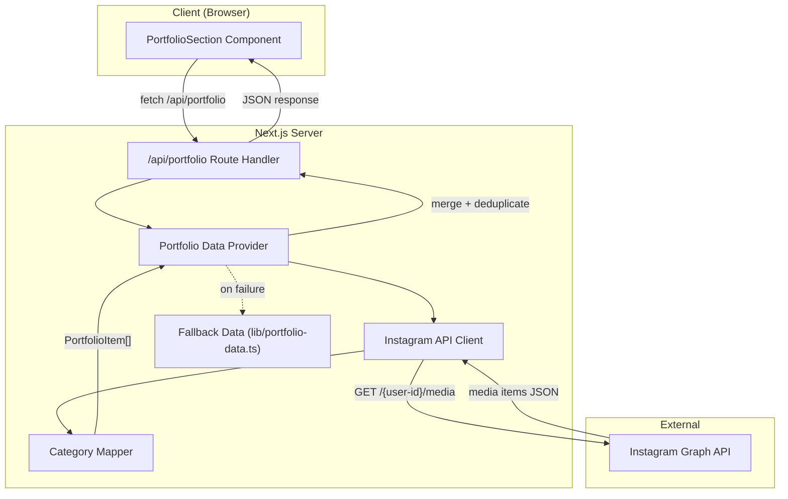

# Design Document: Instagram Portfolio Integration

## Overview

This feature replaces the hardcoded portfolio data workflow with a live Instagram feed integration. The salon owner posts to Instagram with category hashtags, and the website automatically pulls those posts into the existing masonry grid gallery. A server-side caching layer (via Next.js ISR) keeps page loads fast, and the existing local portfolio data serves as a fallback when the API is unavailable.

### Key Design Decisions

1. **Next.js Route Handler + ISR over client-side fetching for the API layer**: The `/api/portfolio` route handler fetches Instagram data server-side and leverages `revalidate` for ISR caching. This keeps the Instagram access token hidden from the client, avoids CORS issues, and provides built-in caching without external infrastructure.

2. **Instagram Graph API (not Basic Display API)**: The Basic Display API was deprecated in December 2024. The Graph API requires a Business or Creator Instagram account linked to a Facebook Page, which is the only supported path forward. ([Meta Developer Docs](https://developers.facebook.com/docs/instagram-platform/instagram-graph-api/reference/ig-user/media/))

3. **Hashtag-based category mapping**: Rather than building an admin UI for categorisation, posts are mapped to portfolio categories via hashtags in the caption (#gel, #acrylics, #nailart, #pressons). This is zero-friction for the salon owner who already uses hashtags.

4. **Graceful degradation**: Every failure path (API down, token expired, empty response) falls back to the existing `lib/portfolio-data.ts` data, so the portfolio section is never empty.

5. **Client-side hydration with fallback-first rendering**: The `PortfolioSection` component renders fallback data immediately on mount, then swaps in the API response when it arrives. This avoids layout shift and ensures the page is never blank.

## Architecture



### Data Flow

1. `PortfolioSection` mounts and renders fallback data immediately.
2. `PortfolioSection` fetches `/api/portfolio`.
3. The route handler invokes `Portfolio Data Provider`.
4. `Portfolio Data Provider` calls `Instagram API Client` to fetch media.
5. If cached (ISR), the cached response is returned without hitting Instagram.
6. `Instagram API Client` calls `GET /v20.0/{user-id}/media?fields=id,media_type,media_url,caption,timestamp,permalink&limit={limit}`.
7. Results are filtered (VIDEO removed), CAROUSEL_ALBUM children fetched for first image.
8. `Category Mapper` maps each post to a `PortfolioCategory` via caption hashtags.
9. Items are transformed into `PortfolioItem[]` and merged with fallback data (deduped by id).
10. The route handler returns JSON with Cache-Control headers.
11. `PortfolioSection` replaces displayed items with the fetched data.

## Components and Interfaces

### 1. Instagram API Client (`lib/instagram/client.ts`)

Handles all communication with the Instagram Graph API.

```typescript
interface InstagramMediaItem {
  id: string;
  media_type: 'IMAGE' | 'VIDEO' | 'CAROUSEL_ALBUM';
  media_url: string;
  caption?: string;
  timestamp: string;
  permalink: string;
}

interface InstagramClientConfig {
  accessToken: string;
  userId: string;
  mediaLimit?: number; // default 30
  timeoutMs?: number;  // default 5000
}

// Public API
function createInstagramClient(config: InstagramClientConfig): {
  fetchMedia(): Promise<InstagramMediaItem[]>;
  refreshToken(): Promise<{ access_token: string; expires_in: number }>;
};
```

**Responsibilities:**
- Read `INSTAGRAM_ACCESS_TOKEN` and `INSTAGRAM_USER_ID` from environment variables
- Fetch media from `GET /v20.0/{userId}/media` with required fields
- Filter out VIDEO media types
- For CAROUSEL_ALBUM items, fetch children and use the first IMAGE child's `media_url`
- Enforce a 5-second timeout on all API calls
- Provide a `refreshToken()` utility for extending the long-lived token

### 2. Category Mapper (`lib/instagram/category-mapper.ts`)

Maps Instagram post captions to portfolio categories via hashtag matching.

```typescript
import type { PortfolioCategory } from '@/lib/constants';

// Hashtag-to-category mapping
const HASHTAG_MAP: Record<string, PortfolioCategory> = {
  '#gel': 'Gel',
  '#acrylics': 'Acrylics',
  '#nailart': 'Nail Art',
  '#pressons': 'Press-Ons',
};

const DEFAULT_CATEGORY: PortfolioCategory = 'Nail Art';

function mapCaptionToCategory(caption: string | undefined): PortfolioCategory;
```

**Behaviour:**
- Extract all hashtags from the caption using a regex
- Normalise to lowercase for case-insensitive matching
- Return the category for the first recognised hashtag found (scanning left to right)
- Return `'Nail Art'` as the default when no recognised hashtag is found or caption is absent

### 3. Portfolio Data Provider (`lib/instagram/portfolio-provider.ts`)

Orchestrates fetching, transforming, and merging Instagram data with fallback data.

```typescript
import type { PortfolioItem } from '@/lib/constants';

function transformInstagramItem(item: InstagramMediaItem): PortfolioItem;
function getPortfolioItems(): Promise<PortfolioItem[]>;
```

**Responsibilities:**
- Transform each `InstagramMediaItem` into a `PortfolioItem`:
  - `id` → Instagram media ID
  - `src` → Instagram `media_url`
  - `alt` → Caption truncated to 120 chars, or `"Nail design by Anna Nails"` if absent
  - `category` → Result of `mapCaptionToCategory(caption)`
  - `aspectRatio` → `'square'` (default for Instagram images)
- Merge Instagram items with fallback data, Instagram items first
- Deduplicate by `id` (Instagram items take precedence)
- On any failure, return fallback data only

### 4. API Route Handler (`app/api/portfolio/route.ts`)

Next.js Route Handler that serves the unified portfolio data.

```typescript
// GET /api/portfolio
export async function GET(): Promise<Response>;
```

**Behaviour:**
- Call `getPortfolioItems()` from the Portfolio Data Provider
- Return JSON array with status 200
- Set `Cache-Control: public, s-maxage=3600, stale-while-revalidate=86400`
- On unhandled errors, return fallback data with status 200 (never expose errors to client)

### 5. Updated PortfolioSection (`components/PortfolioSection.tsx`)

Minimal changes to the existing component to fetch from the API.

**Changes:**
- Add `useEffect` + `useState` to fetch from `/api/portfolio` on mount
- Initialise state with `portfolioItems` from `lib/portfolio-data.ts` (immediate render)
- On successful fetch, replace state with API response
- On fetch failure, keep displaying fallback data (no error UI)
- All existing filter tabs, masonry grid, and Framer Motion animations remain unchanged

### 6. Next.js Config Update (`next.config.mjs`)

Add Instagram CDN domains to `images.remotePatterns`.

```javascript
const nextConfig = {
  images: {
    remotePatterns: [
      {
        protocol: 'https',
        hostname: '**.cdninstagram.com',
      },
      {
        protocol: 'https',
        hostname: '**.fbcdn.net',
      },
    ],
  },
};
```

## Data Models

### Instagram API Response (External)

The Instagram Graph API `/{user-id}/media` endpoint returns:

```typescript
interface InstagramApiResponse {
  data: InstagramMediaItem[];
  paging?: {
    cursors: { before: string; after: string };
    next?: string;
  };
}

interface InstagramMediaItem {
  id: string;
  media_type: 'IMAGE' | 'VIDEO' | 'CAROUSEL_ALBUM';
  media_url: string;
  caption?: string;
  timestamp: string;   // ISO 8601
  permalink: string;
}

interface InstagramChildrenResponse {
  data: Array<{
    id: string;
    media_type: 'IMAGE' | 'VIDEO';
    media_url: string;
  }>;
}
```

### PortfolioItem (Existing, Unchanged)

```typescript
interface PortfolioItem {
  id: string;
  src: string;
  alt: string;
  category: PortfolioCategory;  // 'Gel' | 'Acrylics' | 'Nail Art' | 'Press-Ons'
  aspectRatio: 'portrait' | 'landscape' | 'square';
}
```

### Environment Variables (New)

| Variable | Description | Required |
|---|---|---|
| `INSTAGRAM_ACCESS_TOKEN` | Long-lived Instagram Graph API access token | No (falls back to local data) |
| `INSTAGRAM_USER_ID` | Instagram Business/Creator account user ID | No (falls back to local data) |

### Hashtag-to-Category Mapping

| Hashtag | Category |
|---|---|
| `#gel` | Gel |
| `#acrylics` | Acrylics |
| `#nailart` | Nail Art |
| `#pressons` | Press-Ons |
| *(none matched)* | Nail Art (default) |


## Correctness Properties

*A property is a characteristic or behavior that should hold true across all valid executions of a system — essentially, a formal statement about what the system should do. Properties serve as the bridge between human-readable specifications and machine-verifiable correctness guarantees.*

### Property 1: Video media type exclusion

*For any* array of Instagram media items containing a mix of IMAGE, VIDEO, and CAROUSEL_ALBUM types, after filtering, the result SHALL contain zero items with `media_type === 'VIDEO'`, and every IMAGE and CAROUSEL_ALBUM item from the input SHALL be present in the output.

**Validates: Requirements 1.3**

### Property 2: Hashtag-to-category mapping with case insensitivity

*For any* Instagram post caption containing a recognised hashtag (`#gel`, `#acrylics`, `#nailart`, `#pressons`) in any combination of upper and lower case characters, the Category Mapper SHALL return the corresponding portfolio category, and the result SHALL be identical regardless of the hashtag's case.

**Validates: Requirements 3.1, 3.2**

### Property 3: First recognised hashtag determines category

*For any* Instagram post caption containing two or more recognised hashtags at known positions, the Category Mapper SHALL return the category corresponding to the hashtag that appears earliest in the caption string.

**Validates: Requirements 3.3**

### Property 4: Default category for unrecognised captions

*For any* string that does not contain any of the recognised hashtags (`#gel`, `#acrylics`, `#nailart`, `#pressons`), the Category Mapper SHALL return `'Nail Art'` as the category.

**Validates: Requirements 3.4**

### Property 5: Instagram-to-PortfolioItem transformation completeness

*For any* valid Instagram media item, the transformation function SHALL produce a PortfolioItem where: `id` equals the Instagram media ID, `src` equals the Instagram `media_url`, `category` is a valid `PortfolioCategory`, and `aspectRatio` is `'square'`.

**Validates: Requirements 5.1, 5.2, 5.3, 5.5**

### Property 6: Alt text truncation and fallback

*For any* Instagram media item, the generated alt text SHALL be at most 120 characters long. If the caption is present and non-empty, the alt text SHALL be the caption truncated to 120 characters. If the caption is absent or empty, the alt text SHALL be `"Nail design by Anna Nails"`.

**Validates: Requirements 5.4**

### Property 7: Merge deduplication and ordering

*For any* array of Instagram-sourced PortfolioItems and the fallback PortfolioItem array, the merged result SHALL contain no duplicate `id` values, Instagram-sourced items SHALL appear before fallback items, and when an Instagram item and a fallback item share the same `id`, only the Instagram-sourced item SHALL be retained.

**Validates: Requirements 8.2**

## Error Handling

### Instagram API Failures

| Failure Scenario | Handling Strategy |
|---|---|
| API request timeout (>5s) | Catch timeout error, log warning, return fallback data |
| HTTP 401 / token expired | Log warning with error details, return fallback data |
| HTTP 5xx / network error | Catch error, log warning, return fallback data |
| Empty media list returned | Detect empty `data` array, return fallback data |
| Malformed JSON response | Catch parse error, log warning, return fallback data |
| Missing env variables | Skip API call entirely, return fallback data |

### Partial Response Handling

When the API returns a mix of valid and malformed items:
- Each item is individually validated during transformation
- Malformed items (missing required fields) are silently skipped
- Successfully parsed items are merged with fallback data
- A warning is logged with the count of skipped items

### Route Handler Error Boundary

The `/api/portfolio` route handler wraps all logic in a try/catch:
- On success: return JSON array with 200
- On any unhandled error: log the error, return fallback data with 200
- The client never receives an error response from this endpoint

### Client-Side Error Handling

The `PortfolioSection` component:
- Renders fallback data immediately (no loading spinner)
- Wraps the fetch in a try/catch
- On fetch failure: silently keeps displaying fallback data
- No error messages, toasts, or error UI shown to visitors

## Testing Strategy

### Property-Based Tests (using fast-check)

The project will use [fast-check](https://github.com/dubzzz/fast-check) as the property-based testing library, integrated with the existing Jest setup.

Each property test runs a minimum of **100 iterations** with randomly generated inputs.

| Property | Module Under Test | Tag |
|---|---|---|
| Property 1: Video filtering | `lib/instagram/client.ts` (filter function) | Feature: instagram-portfolio-integration, Property 1: Video media type exclusion |
| Property 2: Hashtag mapping | `lib/instagram/category-mapper.ts` | Feature: instagram-portfolio-integration, Property 2: Hashtag-to-category mapping with case insensitivity |
| Property 3: First hashtag wins | `lib/instagram/category-mapper.ts` | Feature: instagram-portfolio-integration, Property 3: First recognised hashtag determines category |
| Property 4: Default category | `lib/instagram/category-mapper.ts` | Feature: instagram-portfolio-integration, Property 4: Default category for unrecognised captions |
| Property 5: Transformation | `lib/instagram/portfolio-provider.ts` | Feature: instagram-portfolio-integration, Property 5: Instagram-to-PortfolioItem transformation completeness |
| Property 6: Alt text | `lib/instagram/portfolio-provider.ts` | Feature: instagram-portfolio-integration, Property 6: Alt text truncation and fallback |
| Property 7: Merge dedup | `lib/instagram/portfolio-provider.ts` | Feature: instagram-portfolio-integration, Property 7: Merge deduplication and ordering |

### Unit Tests (example-based)

| Test | Module | What It Verifies |
|---|---|---|
| Fetches media with correct fields and limit | Instagram API Client | Requirements 1.1, 1.2 |
| CAROUSEL_ALBUM uses first child image | Instagram API Client | Requirement 1.4 |
| Token refresh calls correct endpoint | Instagram API Client | Requirement 7.3 |
| 401 response logs warning and returns fallback | Instagram API Client | Requirement 7.2 |
| Missing env vars returns fallback without API call | Portfolio Data Provider | Requirement 4.2 |
| Empty API response returns fallback | Portfolio Data Provider | Requirement 4.3 |
| API timeout returns fallback | Portfolio Data Provider | Requirement 4.1 |
| Route returns JSON with correct Cache-Control | API Route Handler | Requirements 8.1, 8.3 |
| Route returns fallback on unhandled error | API Route Handler | Requirement 8.4 |

### Component Tests

| Test | What It Verifies |
|---|---|
| Renders fallback data on mount before fetch completes | Requirement 9.2 |
| Replaces items after successful fetch | Requirement 9.3 |
| Keeps fallback data on fetch failure, no error UI | Requirement 9.4 |
| Filter tabs and masonry grid present with Instagram items | Requirement 9.5 |
| Fetches from /api/portfolio on mount | Requirement 9.1 |

### Smoke / Configuration Tests

| Test | What It Verifies |
|---|---|
| next.config.mjs includes Instagram CDN remotePatterns | Requirement 6.1 |
| ISR revalidate option is configured | Requirements 2.1, 2.4 |
