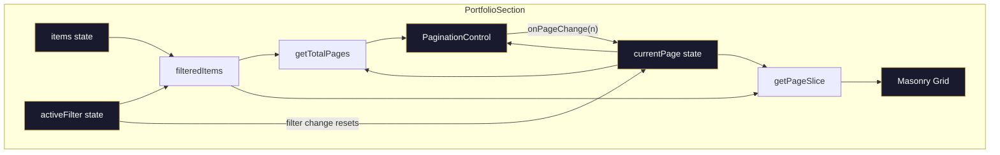

# Design Document: Portfolio Pagination

## Overview

This design adds client-side pagination to the `PortfolioSection` component. Today the component renders every filtered portfolio item in a single masonry grid. As the item count grows (especially with Instagram-sourced content), this creates an overwhelming gallery. Pagination caps the visible items at a configurable page size (default 6), adds a navigation control below the grid, and integrates with the existing category filter tabs so that switching categories always resets to page 1.

The implementation is entirely client-side. No API changes are needed — the existing `/api/portfolio` endpoint already returns the full item set, and the component already holds all items in React state. Pagination is a pure slicing operation over the `filteredItems` array.

### Key Design Decisions

1. **Pure utility function for slice computation** — The pagination math (`getPageSlice`, `getTotalPages`) lives in a standalone `lib/pagination.ts` module with no React dependencies. This makes the logic trivially testable with property-based tests and reusable outside the component.

2. **State co-located in PortfolioSection** — `currentPage` is a simple `useState` value managed alongside the existing `activeFilter` state. No external state management is needed.

3. **Dedicated PaginationControl component** — The nav bar is extracted into its own component (`components/PaginationControl.tsx`) for clarity, testability, and reuse. It receives all data via props and is fully presentational.

4. **Framer Motion AnimatePresence for page transitions** — The existing `AnimatePresence` wrapper around the masonry grid already handles enter/exit animations. Page changes swap the key on the grid container to trigger a full exit → enter cycle, giving a smooth fade transition.

5. **Responsive compact mode** — On viewports below 768 px, the control hides individual page numbers and shows only prev/current/next. On wider screens, all page numbers are visible.

## Architecture



### Data Flow

1. `PortfolioSection` holds three pieces of state: `items` (from API/fallback), `activeFilter`, and `currentPage`.
2. `filteredItems` is derived by filtering `items` by `activeFilter` (existing logic).
3. `getTotalPages(filteredItems.length, pageSize)` computes the page count.
4. `getPageSlice(filteredItems, currentPage, pageSize)` returns the items for the current page.
5. Only the sliced items are passed to the masonry grid.
6. `PaginationControl` renders navigation UI and calls `onPageChange` when the user interacts.
7. When `activeFilter` changes, a `useEffect` resets `currentPage` to 1.

## Components and Interfaces

### 1. `lib/pagination.ts` — Pure Pagination Utilities

```typescript
/** Default number of items per page. */
export const DEFAULT_PAGE_SIZE = 6;

/**
 * Returns the total number of pages for the given item count and page size.
 * Always returns at least 1.
 */
export function getTotalPages(itemCount: number, pageSize: number = DEFAULT_PAGE_SIZE): number;

/**
 * Returns the slice of items for the given 1-based page number.
 * Clamps page to [1, totalPages] to prevent out-of-range access.
 */
export function getPageSlice<T>(items: T[], page: number, pageSize: number = DEFAULT_PAGE_SIZE): T[];
```

### 2. `components/PaginationControl.tsx` — Presentational Pagination Nav

```typescript
export interface PaginationControlProps {
  /** Current 1-based page number. */
  currentPage: number;
  /** Total number of pages. */
  totalPages: number;
  /** Callback when the user selects a page. */
  onPageChange: (page: number) => void;
}

export default function PaginationControl(props: PaginationControlProps): JSX.Element | null;
```

Rendering rules:
- Returns `null` when `totalPages <= 1`.
- Wraps content in `<nav aria-label="Portfolio pagination">`.
- Previous button: disabled when `currentPage === 1`, labelled "Go to previous page".
- Next button: disabled when `currentPage === totalPages`, labelled "Go to next page".
- Page indicators: each is a `<button>` with `aria-current="page"` on the active one.
- On viewports < 768 px, only the current page number is shown between prev/next (compact mode).
- On viewports ≥ 768 px, all page numbers are shown.
- All interactive elements have a minimum 44×44 px touch target.
- Gold accent (`#C9A84C`) highlights the active page and hover states.
- Font: Inter, uppercase, `tracking-[0.2em]` — matching the filter tabs.

### 3. `components/PortfolioSection.tsx` — Updated

Changes to the existing component:
- Add `currentPage` state (initial: 1).
- Add `useEffect` that resets `currentPage` to 1 when `activeFilter` changes.
- Compute `totalPages` and `pageSlice` from `filteredItems`.
- Pass `pageSlice` (instead of `filteredItems`) to the masonry grid.
- Wrap the masonry grid in a keyed container (`key={currentPage}`) inside `AnimatePresence` to trigger page transition animations.
- Add `scrollIntoView` call on page change to scroll to the top of the section.
- Render `<PaginationControl>` below the grid.
- Respect `useReducedMotion` for page transitions (skip animation, display immediately).

## Data Models

### Existing Types (unchanged)

```typescript
// From lib/constants.ts — no modifications needed
interface PortfolioItem {
  id: string;
  src: string;
  alt: string;
  category: PortfolioCategory;
  aspectRatio: 'portrait' | 'landscape' | 'square';
}

type PortfolioCategory = 'Gel' | 'Acrylics' | 'Nail Art' | 'Press-Ons';
```

### New Types

```typescript
// PaginationControlProps (defined in components/PaginationControl.tsx)
interface PaginationControlProps {
  currentPage: number;   // 1-based
  totalPages: number;    // ≥ 1
  onPageChange: (page: number) => void;
}
```

### State Shape in PortfolioSection

| State variable | Type | Initial | Description |
|---|---|---|---|
| `items` | `PortfolioItem[]` | `portfolioItems` | Full item set (existing) |
| `activeFilter` | `FilterCategory` | `"All"` | Active category tab (existing) |
| `currentPage` | `number` | `1` | 1-based current page (new) |

### Derived Values

| Value | Computation |
|---|---|
| `filteredItems` | `items.filter(...)` by `activeFilter` (existing) |
| `totalPages` | `getTotalPages(filteredItems.length, DEFAULT_PAGE_SIZE)` |
| `pageSlice` | `getPageSlice(filteredItems, currentPage, DEFAULT_PAGE_SIZE)` |


## Correctness Properties

*A property is a characteristic or behavior that should hold true across all valid executions of a system — essentially, a formal statement about what the system should do. Properties serve as the bridge between human-readable specifications and machine-verifiable correctness guarantees.*

### Property 1: Slice computation correctness

*For any* array of items, *for any* page size ≥ 1, and *for any* valid page number from 1 to `getTotalPages(items.length, pageSize)`, `getPageSlice(items, page, pageSize)` SHALL return exactly `items.slice((page - 1) * pageSize, page * pageSize)`.

**Validates: Requirements 1.1, 1.3, 1.4, 8.1, 8.2**

Reasoning: This single property subsumes five acceptance criteria. If the slice is computed correctly for every valid page, then:
- The result length is always ≤ pageSize (1.1).
- When items fit on one page, page 1 returns all items (1.3).
- Page 1 always returns the first pageSize items when items exceed pageSize (1.4).
- The index range is exactly `(page-1)*pageSize` to `page*pageSize - 1` (8.1).
- The last page naturally contains only the remaining items (8.2).

### Property 2: Page union completeness (round-trip)

*For any* array of items and *for any* page size ≥ 1, concatenating `getPageSlice(items, page, pageSize)` for every page from 1 to `getTotalPages(items.length, pageSize)` SHALL produce an array that is identical to the original items array — same elements, same order, no duplicates, no omissions.

**Validates: Requirements 8.3**

Reasoning: Property 1 verifies each individual page is correct, but does not guarantee that iterating all pages covers the entire input. This round-trip property ensures completeness: every item is reachable through pagination, and no item appears on more than one page.

## Error Handling

| Scenario | Handling |
|---|---|
| `currentPage` exceeds `totalPages` after filter change | `useEffect` resets `currentPage` to 1 whenever `activeFilter` changes. Additionally, `getPageSlice` clamps the page to `[1, totalPages]` as a safety net. |
| `filteredItems` is empty | `getTotalPages` returns 1 (minimum). `getPageSlice` returns `[]`. `PaginationControl` returns `null` since `totalPages ≤ 1`. The masonry grid renders nothing — same as current behavior. |
| `pageSize` is 0 or negative | `getTotalPages` and `getPageSlice` treat invalid page sizes as `DEFAULT_PAGE_SIZE` (6). This prevents division-by-zero and infinite page counts. |
| `page` is 0, negative, or NaN | `getPageSlice` clamps to page 1. |
| API fetch fails | Existing behavior — fallback data is used. Pagination works identically over fallback items. |

## Testing Strategy

### Property-Based Tests (fast-check)

Property-based tests validate the two correctness properties using the `fast-check` library (already a project dependency). Each test runs a minimum of 100 iterations with randomly generated inputs.

**File:** `__tests__/lib/pagination.property.test.ts`

| Test | Property | Generators |
|---|---|---|
| Slice matches `Array.slice` for all valid pages | Property 1 | Random arrays (0–50 items), random pageSize (1–20), random valid page number |
| Concatenation of all page slices equals original array | Property 2 | Random arrays (0–50 items), random pageSize (1–20) |

Each test is tagged with: `Feature: portfolio-pagination, Property {N}: {description}`

Configuration: `{ numRuns: 100 }`

### Unit Tests (Jest + Testing Library)

Unit tests cover specific examples, UI behavior, accessibility, and integration points.

**File:** `__tests__/lib/pagination.test.ts` — Pure function examples

| Test | Validates |
|---|---|
| `DEFAULT_PAGE_SIZE` equals 6 | Req 1.2 |
| `getTotalPages` returns 1 for empty array | Edge case |
| `getTotalPages` returns correct count for various lengths | Req 8.1 |
| `getPageSlice` clamps out-of-range page numbers | Error handling |

**File:** `__tests__/components/PaginationControl.test.tsx` — Component tests

| Test | Validates |
|---|---|
| Returns null when `totalPages ≤ 1` | Req 2.2 |
| Renders nav with `aria-label="Portfolio pagination"` | Req 6.1 |
| Renders prev button, next button, and page indicators | Req 2.3 |
| Active page has `aria-current="page"` | Req 6.2 |
| Prev/next buttons have descriptive `aria-label` | Req 6.3 |
| Prev button disabled on page 1 with `aria-disabled="true"` | Req 3.4, 6.4 |
| Next button disabled on last page with `aria-disabled="true"` | Req 3.5, 6.4 |
| Clicking page number calls `onPageChange` with that number | Req 3.1 |
| Clicking next calls `onPageChange(currentPage + 1)` | Req 3.2 |
| Clicking prev calls `onPageChange(currentPage - 1)` | Req 3.3 |
| Active page styled with gold accent | Req 2.4 |
| Buttons have min 44×44 px touch target classes | Req 7.1 |
| Compact layout hides page numbers below 768 px | Req 7.2 |
| Full layout shows all page numbers at ≥ 768 px | Req 7.3 |
| All interactive elements are native buttons (keyboard accessible) | Req 6.5 |

**File:** `__tests__/components/PortfolioSection.test.tsx` — Integration tests (extend existing)

| Test | Validates |
|---|---|
| Displays at most 6 items on initial render when items > 6 | Req 1.1, 1.4 |
| Pagination control appears when items exceed page size | Req 2.1 |
| Pagination control hidden when items ≤ page size | Req 2.2 |
| Changing category filter resets to page 1 | Req 4.1 |
| Changing to category with ≤ 6 items hides pagination | Req 4.3 |
| Page change scrolls to section top | Req 5.3 |
| Reduced motion skips animations | Req 5.2 |
